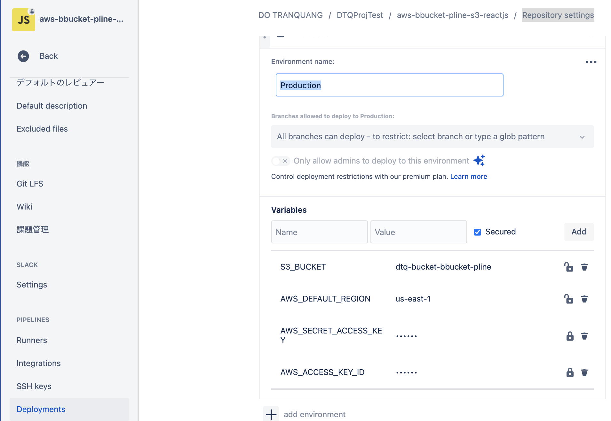
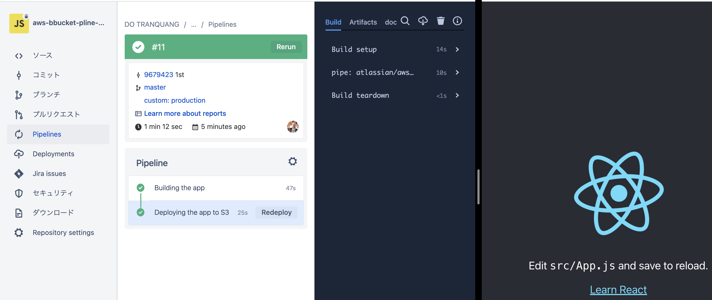

# aws-bbucket-pline-s3-reactjs 🐳


[](https://github.com/tquangdo/aws-bbucket-pline-s3-reactjs/issues/new)

## reference
[youtube](https://www.youtube.com/watch?v=SC2XzQ-tKKQ)

## Creating a new React project
```shell
git clone https://dotranquang@bitbucket.org/dotranquang/aws-bbucket-pline-s3-reactjs.git
cd aws-bbucket-pline-s3-reactjs
npx create-react-app .
```

## S3
- create bucketname=`dtq-bucket-bbucket-pline`
- Object Ownership=`ACLs enabled` & `Bucket owner preferred`
- permissions > Block all public access=`Off`
- Bucket policy=
```json
{
    "Version": "2012-10-17",
    "Statement": [
        {
            "Sid": "Statement1",
            "Effect": "Allow",
            "Principal": "*",
            "Action": [
                "s3:GetObject",
                "s3:PutObject"
            ],
            "Resource": "arn:aws:s3:::dtq-bucket-bbucket-pline/*"
        }
    ]
}
```

## Setting up a Branch Pipeline (dependencies, build and test)
- create `bitbucket-pipelines.yml`
- bitbucket > `Repository settings` > `Pipelines` > `Deployments` > `Production` > Add variables:

```shell
git add .
git commit -m '1st'
git push
```
- bitbucket > `Pipelines` > CICD's result is OK
- click `Run pipeline` > branch=`master` & pipeline=`custom:production`
- s3 > dtq-bucket-bbucket-pline > index.html > click `Object URL`


## Testing a code change to trigger a new deployment to Amazon S3
- edit `src/App.js`
```js
<h1>DTQ!!!</h1>
```
- push again
```shell
...
git push
```
- click `Run pipeline` > branch=`master` & pipeline=`custom:production` & see the changed result

